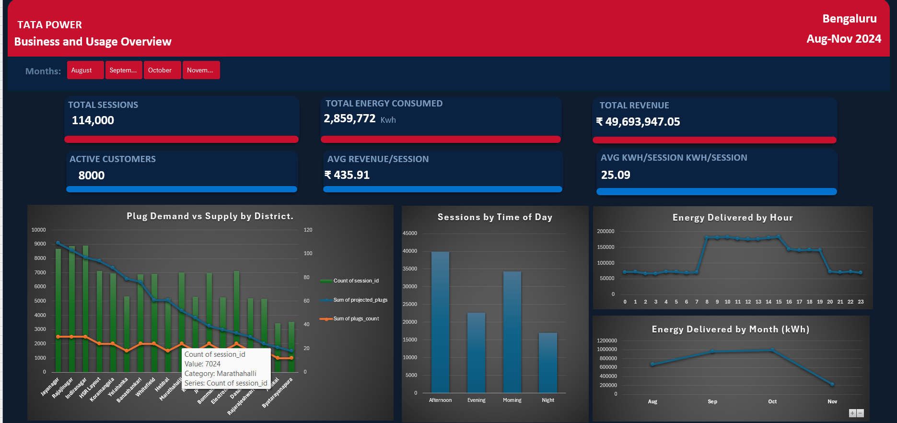
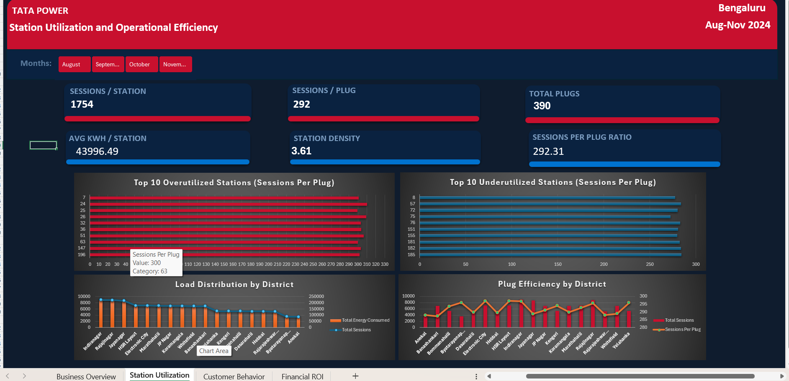
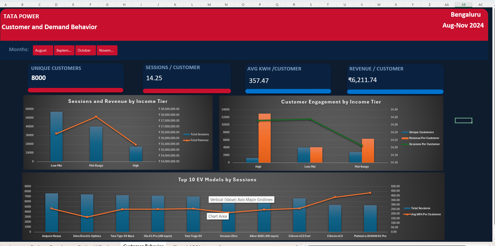
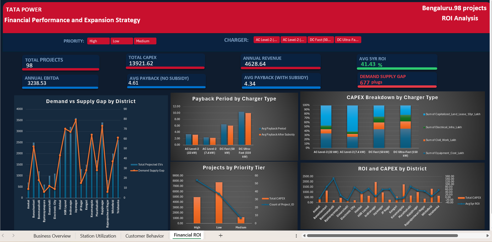

# Tata Power EV Charging Infrastructure Dashboard

Interactive four-page Excel dashboard analysing 114,000 EV charging sessions across 18 Bengaluru districts (Aug–Nov 2024) — covering station utilisation, customer segmentation, and ROI-based expansion prioritisation across 98 candidate projects.

Built to support senior management decisions on where to deploy new stations, how to price across the network, and which charger types actually earn their capital back.

**Stack:** Microsoft Excel · Power Query · Power Pivot · DAX · PivotTables · slicers

---

## Headline numbers

| | |
|---|---|
| Charging sessions | 114,000 |
| Energy delivered | 2,859,772 kWh |
| Revenue | ₹49,693,947 |
| Active customers | 8,000 |
| Installed plugs | 390 across 65 stations |
| Projects modelled | 98 |
| Average 5-year ROI | 41.43% |
| Demand–supply gap | 677 plugs |

---

## Key findings

**1. Charger type drives payback far more than subsidy does.**
AC Level-2 (7.4 kW) pays back in ~2.2 years. DC Ultra-Fast (150 kW) takes ~10.2 years — a 4.6x spread. Meanwhile subsidy moves the network average from 4.61 to 4.34 years, roughly three months. The mix decision is worth an order of magnitude more than the subsidy decision, which argues for AC-weighted deployment wherever dwell time allows it.

**2. Projected demand is 2.7x installed supply.**
390 plugs are installed against a 677-plug shortfall. The gap concentrates in Jayanagar, Rajajinagar, Koramangala and Yelahanka — these are the Tier 1 expansion candidates on demand grounds alone, before ROI is even considered.

**3. Capital is currently weighted toward the wrong tier.**
Low-priority projects carry ~₹7,800 lakh of planned CAPEX against ~₹5,000 lakh for High-priority projects, despite High covering more projects (55 vs 35). Reallocating even a fraction of that toward the high-gap districts above would improve blended network ROI without new capital.

**4. High-income customers are 15% of the base but ~3x the revenue per head.**
The High tier is ~1,200 of 8,000 customers yet returns roughly ₹12,700 per customer, against ~₹4,100 for Low-Mid. Sessions per customer is almost identical across all three tiers (14.20–14.28), so the difference is entirely per-session value, not visit frequency — a pricing and charger-placement signal rather than an engagement one.

**5. Demand is daytime-concentrated, leaving overnight capacity idle.**
Afternoon and morning account for ~74,000 of 114,000 sessions (65%). Hourly energy delivery jumps roughly 2.5x at 08:00, holds to 16:00, then falls away. Overnight hours run at about a third of peak throughput — the clearest case in the data for time-of-use tariffs.

---

## Caveats

Stated up front because they affect how the findings should be read:

- **November is a partial month.** Energy delivered drops from ~1.0M kWh in October to ~200k in November. This is a data coverage cut-off, not a demand collapse, and month-over-month trend charts should be read to October.
- **Utilisation is unusually uniform.** The most-utilised stations run ~310 sessions per plug against ~280 for the least — a spread of only ~10%. Real networks vary far more, so the over/under-utilised rankings should be treated as relative ordering rather than evidence of genuine capacity stress at individual sites.

---

## Dashboard pages

**Page 1 — Business and Usage Overview.** Demand evolution, network throughput, and time-of-day behaviour.
*Sessions · energy delivered · revenue · active customers · avg revenue per session (₹435.91) · avg kWh per session (25.09)*

**Page 2 — Station Utilisation and Operational Efficiency.** Over- and under-utilised sites, plug efficiency, and district load distribution.
*Sessions per station (1,754) · sessions per plug (292) · avg kWh per station (43,996) · station density (3.61 per district)*

**Page 3 — Customer and Demand Behaviour.** Income tier economics, engagement, and usage across EV models and battery capacities.
*Unique customers · sessions per customer (14.25) · avg kWh per customer (357.47) · revenue per customer (₹6,211.74)*

**Page 4 — Financial Performance and Expansion Strategy.** Payback by charger type, CAPEX composition, demand gaps, and priority tiering across 98 projects.
*Total CAPEX (₹13,921.62 lakh) · annual revenue (₹4,628.64 lakh) · annual EBITDA (₹3,238.53 lakh) · payback with and without subsidy · 5-year ROI · demand–supply gap*

---

## How it was built

The workbook uses a star-schema data model rather than flat sheets: a fact table of charging sessions related to dimension tables for stations, customers, vehicles, and projects. Every KPI is a DAX measure written against that model, so all four pages respond to a shared slicer set rather than each page maintaining its own filtered copy of the data.

**Design decisions:**

- **Utilisation is measured as sessions per plug, not sessions per station** — otherwise a six-plug site is unfairly penalised against a two-plug site. Station-level counts are retained separately for capacity planning.
- **CAPEX is decomposed into four components** — equipment, civil work, electrical infrastructure, and capitalised 10-year land lease — because the mix shifts substantially by charger type. Land lease dominates AC Level-2 economics while equipment dominates DC Ultra-Fast, and that difference is what drives the payback spread in finding 1.
- **Payback is modelled twice**, with and without subsidy, so the subsidy's actual contribution is visible rather than assumed.

---

## Repository contents

| Path | Contents |
|---|---|
| `dashboard/` | Excel workbook — open and enable content to activate the data model |
| `presentation/` | Summary deck prepared for the milestone submission |
| `screenshots/` | Static captures of each dashboard page |
| `data/` | Notes on sourcing the dataset (raw data not committed) |

---

## Context

Completed as Milestone Project 1 of the WsCube Tech Data Analytics Mentorship Programme.

---

**Suresh Deuja** — BSc Computing Systems, Ulster University London
[LinkedIn](https://www.linkedin.com/in/suresh-deuja-209305391/)
